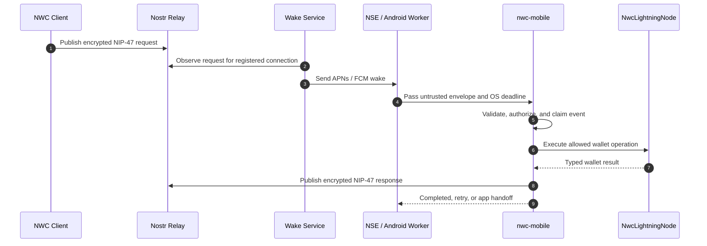

# nwc-mobile

`nwc-mobile` is a Rust library for adding Nostr Wallet Connect (NWC) and Nostr
Wallet Auth (NWA) to mobile Lightning wallets. It is designed for applications
that may be suspended or terminated when an NIP-47 request arrives and need
APNs, FCM, an iOS Notification Service Extension (NSE), or Android background
work to wake them.

> **Status:** Early development. The public API, storage schema, and generated
> native bindings are not yet stable. Pin production integrations to a reviewed
> commit rather than a moving branch.

## What the library owns

`nwc-mobile` keeps security-sensitive, platform-independent behavior in Rust:

- NIP-47 validation, authorization, decryption, execution, and responses;
- durable replay protection and idempotent event claims;
- payment budgets, fee limits, and crash-safe reconciliation;
- connection creation, revisions, usage, and permanent revocation;
- NWA parsing, approval binding, and verified callback construction;
- relay validation, wake registration, retries, and settlement notifications;
- native execution deadlines, cancellation, and safe outcome classification.

Swift and Kotlin remain thin operating-system adapters. They receive pushes,
provide secure storage and wallet capabilities, schedule background work, open
verified links, and render Rust-provided presentation state.

## What an integrating wallet supplies

An application adopting `nwc-mobile` supplies six pieces:

| Piece | The application supplies | `nwc-mobile` supplies |
| --- | --- | --- |
| NWA and NWC UI | Screens, navigation, and user actions | Validated presentation models and connection lifecycle |
| Native background integration | A small NSE or FCM/WorkManager entry point | Wake validation, execution, deadlines, retries, and deduplication |
| Lightning integration | `NwcLightningNode` and a cold-start `LightningNodeProvider` | Authorization, accounting, reconciliation, and response publication |
| NWA application glue | Incoming-link routing and verified callback opening | Parsing, validation, approval binding, and callback construction |
| `NwcMobile` configuration | Data directory, wallet provider, relay transport, secrets, and optional hooks | Ledger, engine, workers, and durable orchestration |
| Wake service | A separately deployed APNs/FCM notification server | Secure registration client and provider-facing protocol contracts |

The wake service is required for reliable delivery while the wallet is
suspended or terminated. It is separate infrastructure rather than code linked
into the wallet application.

## Wake flow



The engine durably reserves payment budget before calling the Lightning node.
If the process ends during an ambiguous payment, the reservation remains
pending until the node can reconcile it by payment hash.

## Primary interfaces

Rust applications normally start with:

- `nwc_mobile::NwcLightningNode` for ordinary Lightning operations;
- `nwc_mobile_tokio::LightningNodeProvider` for opening the wallet after a cold
  background start;
- `nwc_mobile_tokio::NwcMobileConfig` for application capabilities; and
- `nwc_mobile_tokio::NwcMobile` as the owned runtime.

Swift and Kotlin applications use the generated UniFFI API together with the
Apple or Android companion package. Lower-level engine interfaces remain
available for hosts that need custom runtime composition.

## Repository structure

```text
nwc-mobile/
├── crates/
│   ├── nwc-mobile/             # Protocol, policy, ledger, and application workflows
│   ├── nwc-mobile-bolt11/      # BOLT11 adapter helpers
│   ├── nwc-mobile-http/        # Wake registration and completion transport
│   ├── nwc-mobile-nostr/       # Bounded Nostr relay transport
│   ├── nwc-mobile-tokio/       # NwcMobile runtime, deadlines, and node providers
│   └── nwc-mobile-uniffi/      # Stable Swift/Kotlin lifecycle boundary
├── apple/NwcMobileApple/       # iOS NSE and maintenance helpers
├── android/nwc-mobile/         # Android FCM and WorkManager helpers
└── docs/                       # Integration and architecture guides
```

Wallet-specific SDKs and transaction models remain in the containing wallet.
For example, a Bark wallet converts Bark history records into
`WalletTransaction`; an LDK wallet would implement the same interface using its
own payment store.

## Documentation

Start with the [integration guide](docs/getting-started.md), then use the
focused references as needed:

- [Documentation index](docs/README.md)
- [Architecture and responsibility boundaries](docs/architecture.md)
- [Configuring `NwcMobile`](docs/integration/nwc-mobile.md)
- [Implementing `NwcLightningNode`](docs/integration/lightning-node.md)
- [Integrating Nostr Wallet Auth](docs/integration/nwa.md)
- [Building NWA and NWC screens](docs/integration/nwc-ui.md)
- [iOS background execution](docs/integration/ios-background.md)
- [Android background execution](docs/integration/android-background.md)
- [Wake-service integration](docs/integration/wake-server.md)
- [Protocol and background flows](docs/flows/README.md)
- [Security model](docs/security.md)
- [Testing an integration](docs/testing.md)
- [Rebel Wallet reference integration](docs/rebel-wallet-example.md)

Package-specific wiring details remain beside the native packages:

- [NwcMobileApple](apple/NwcMobileApple/README.md)
- [nwc-mobile Android](android/nwc-mobile/README.md)
- [Generated binding contract](bindings/README.md)

## Development

The repository is a Cargo workspace. Run the baseline checks with:

```sh
cargo fmt --all --check
cargo clippy --locked --workspace --all-targets --all-features -- -D warnings
cargo test --locked --workspace --all-features
RUSTDOCFLAGS="-D warnings" cargo doc --locked --workspace --all-features --no-deps
./scripts/check-native-contract.sh
```

See [CONTRIBUTING.md](CONTRIBUTING.md), [SECURITY.md](SECURITY.md),
[SUPPLY_CHAIN.md](SUPPLY_CHAIN.md), and [RELEASING.md](RELEASING.md) for project
policies.

## License

Licensed under the [MIT License](LICENSE).
