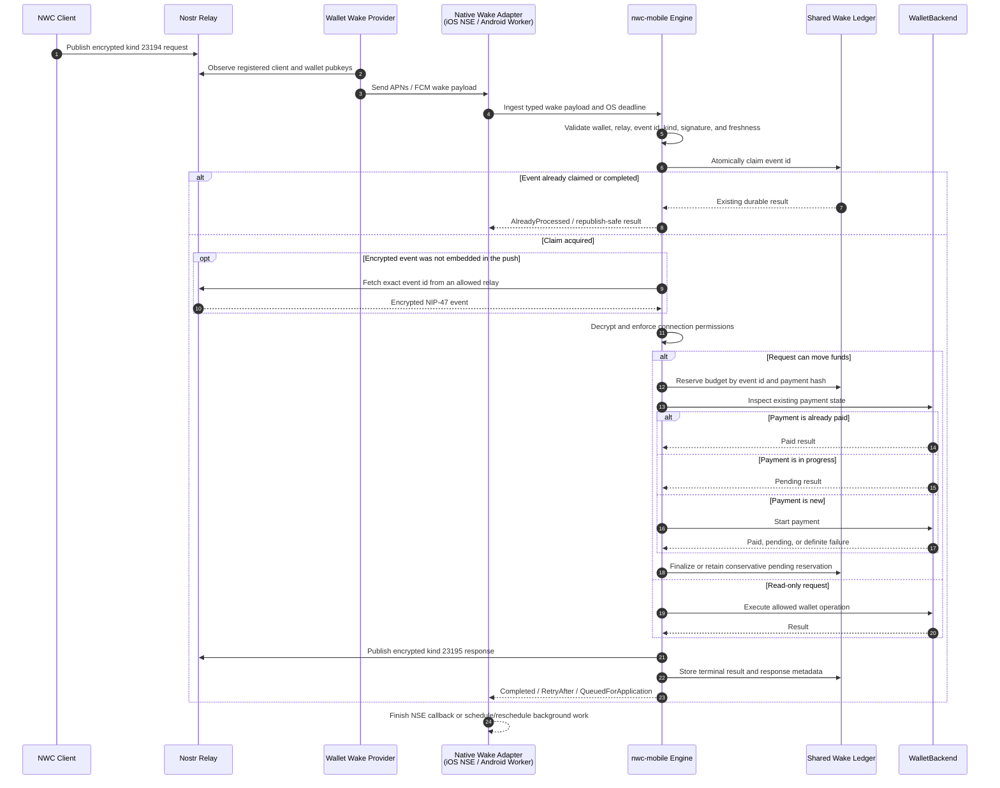

# nwc-mobile

`nwc-mobile` is a Rust library for safely running Nostr Wallet Connect (NWC)
inside mobile wallets. It is intended for wallets that may be suspended or
terminated when an NIP-47 request arrives and need APNs, FCM, an iOS Notification
Service Extension (NSE), or Android background work to wake them.

The library owns the security-sensitive, platform-independent behavior:

- NIP-47 request validation, authorization, decryption, and response building
- durable event claims and replay protection
- payment budget reservation and crash-safe reconciliation
- connection revisions, revocation tombstones, and request freshness
- Nostr relay validation and short-lived request handling
- Nostr Wallet Auth (NWA) request parsing and approval binding
- wake registration state and retry decisions

Native code remains a thin operating-system adapter. Swift and Kotlin receive
pushes, supply secure-storage and wallet capabilities, schedule background work,
and render generic notification content; they do not duplicate NWC policy.

> **Status:** Early development. The Rust engine supports durable read and
> payment execution. The UniFFI layer validates native wake envelopes, owns the
> shared engine ledger and connection lifecycle, and exposes stable,
> non-sensitive outcomes. Its public API, storage schema, and generated native
> bindings are not yet stable.

## How a wake request works



The payment side effect and local database cannot be one distributed
transaction. `nwc-mobile` therefore reserves budget before initiating payment
and reconciles retries by payment hash. A timeout or process termination leaves
a conservative pending reservation instead of silently restoring spendable
budget.

## Repository structure

```text
nwc-mobile/
├── crates/
│   ├── nwc-mobile/             # Rust engine, protocol, ledger, and policy
│   ├── nwc-mobile-bark/        # Optional Bark WalletBackend adapter
│   ├── nwc-mobile-bolt11/      # Optional BOLT11 wallet-adapter helpers
│   ├── nwc-mobile-http/        # HTTPS/NIP-98 wake-registration transport
│   ├── nwc-mobile-nostr/       # Bounded WebSocket relay transport
│   ├── nwc-mobile-tokio/       # Runtime deadline and cancellation enforcement
│   └── nwc-mobile-uniffi/      # Swift/Kotlin lifecycle API
├── apple/
│   └── NwcMobileApple/         # NSE and app lifecycle coordinator
└── android/
    └── nwc-mobile/             # FCM ingestion and WorkManager coordinator
```

The core engine remains independent of a network runtime. Rust hosts that use
Tokio can opt into `nwc-mobile-nostr` for a bounded WSS transport with redirect,
message-size, deadline, and cancellation enforcement. Native companion packages
stay small and optional.

Bark-based wallets can opt into `nwc-mobile-bark` to reuse the complete
`WalletBackend` implementation, including invoice creation and payment,
idempotent status lookup, transaction history conversion, fee enforcement, and
deadline/cancellation handling.

Foreground application loops can use `ForegroundWakeCoordinator` to suppress
duplicate tasks, retain retry attempts across delayed work, apply bounded
exponential backoff to app-owned queues, and translate `WakeDisposition` into a
single terminal-or-retry action.

Application icon hosts can use `ApplicationIconUrl` and `ApplicationIconCache`
for public-HTTPS validation, deterministic cache paths, stale temporary-file
cleanup, atomic normalized-byte storage, and versioned local file URLs.
`nwc-mobile-http::download_application_icon` adds a 15-second network deadline,
disables redirects, requires an image response, and streams at most 5 MiB. The
host remains free to normalize supported image formats before storing them.

Native entry points can parse provider JSON with `WakeEnvelope`, share an
`AtomicCancellation`, and use `run_bounded_background_wake` so wallet setup and
engine execution consume one monotonic OS budget. Bark hosts can call
`execute_bark_wake` from foreground and background paths without rebuilding the
engine wiring. Rust host adapters invoked by Swift or Kotlin entry points can
wrap that work with `run_on_native_runtime`; one process-wide runtime thread
owns Tokio timers and I/O instead of requiring every host to construct a
runtime. Dropping the host future aborts its spawned operation.

## Host integration

### Batteries-included service facade

Applications should start with `NwcMobileService` in Rust or `MobileNwcEngine`
through Swift/Kotlin. These facades own the complete connection lifecycle:

Application-level helpers also validate connection drafts, canonicalize relay
storage, select conservative fee reserves, build export URIs, and derive
non-sensitive connection presentations. The UniFFI package contains shared
connection views, NWA session state, wake envelopes, and wake-history records,
leaving host wallets to own only product metadata, secret storage, navigation,
and wallet opening.

Rust hosts can implement `ClientSecretStore` over Keychain or Android Keystore
and call `NwcMobileService::create_wallet_connection`,
`approve_application_nwa`, `export_wallet_connection_uri`, and
`revoke_application_connection`. These methods keep key generation, rollback,
URI validation, request binding, durable authorization, and secret cleanup in
one reviewed workflow instead of recreating it in each wallet.

- validated host connection creation and idempotent legacy migration;
- retained NWA request review and authority-bound approval;
- durable usage lookup and permanent revision-bound revocation;
- wake-registration refresh, bounded provider processing, and payment
  reconciliation; and
- validated wake execution through narrow wallet, relay, and secret
  capabilities.

The containing wallet maps its persisted display model into one connection
record and supplies OS/wallet capabilities. It should not implement NWA parsing,
connection policy, replay handling, payment accounting, registration outboxes,
or retry state machines. A typical native integration keeps one
`MobileNwcEngine` for the app-owned ledger and calls its lifecycle methods from
UI actions; the iOS NSE or Android worker opens the same ledger and calls
`executeWake`.

For existing wallets, pass the complete old registry once to
`migrateLegacyConnections`, delete records and secrets named by the returned
report, and then treat the `nwc-mobile` ledger as authoritative. New NWA flows
use `openNwaRequest`, render only `MobileNwaRequestPresentation`, call
`approvePendingNwa` with that presentation's `requestIdHex`, and deliver the
verified callback if present. Successful approval atomically consumes the
pending request; cancellation uses `clearPendingNwa`.

A wallet supplies an implementation of a narrow Rust capability interface:

```rust,ignore
pub trait WalletBackend: Send + Sync {
    async fn balance(&self) -> Result<u64, WalletError>;
    async fn make_invoice(&self, request: MakeInvoice) -> Result<Invoice, WalletError>;
    async fn payment_state(&self, hash: PaymentHash) -> Result<PaymentState, WalletError>;
    async fn start_payment(&self, request: PaymentRequest) -> Result<PaymentAttempt, WalletError>;
    async fn lookup_invoice(&self, request: LookupRequest) -> Result<Transaction, WalletError>;
    async fn list_transactions(
        &self,
        request: ListTransactions,
    ) -> Result<Vec<Transaction>, WalletError>;
}
```

Wallet implementations such as Bark, LDK, or a custodial API remain outside
`nwc-mobile`. The engine does not create or delete a wallet database and does not
own application navigation or UI state.

The native host also supplies:

- the app-group or application data directory used by the shared ledger
- scoped access to Keychain or Android Keystore-backed secrets

On Apple platforms, `NwcKeychainVault` supplies the configurable device-only
Keychain primitive and `NwcAppGroupWakeStore` coordinates the cross-process
queue, legacy migration, data directory, and bounded diagnostic log. The host
still owns Info.plist lookup and its application-specific NotificationCenter
event.
- the APNs or FCM token and platform registration metadata
- the OS background deadline and cancellation signal
- localized notification presentation

Secrets are requested only for the operation that needs them. They are not
carried in a mutable JSON snapshot or returned in wake results.

The `nwc-mobile-uniffi` crate exposes these capabilities as foreign traits:
`MobileWalletBackend`, `MobileRelayTransport`, and `MobileSecretProvider`.
Wallet and relay methods are asynchronous and receive both a bounded timeout and
a shared `MobileCancellation` object. Native implementations return only typed
values or a stable `MobileHostError`; raw wallet diagnostics and remote response
bodies stay in protected native logs.

The secret provider is synchronous and on-demand because the engine needs key
material only for one bounded cryptographic operation. It must return a fresh
32-byte buffer from Keychain or Android Keystore-backed storage. Rust validates
and zeroizes its received copies immediately; native code must likewise avoid
caching or logging the temporary buffer.

`MobileNwcEngine` opens the shared SQLite ledger at an absolute app-owned path.
The containing application persists a fully approved connection through
`add_connection`, retains its returned revision, and uses that revision for
permanent compare-and-revoke. Approval and revocation timestamps come from the
Rust system clock rather than caller-provided values. Each `execute_wake` call
receives its own execution budget and `MobileCancellation`, so an NSE or Android
worker can cancel one background attempt without poisoning later foreground
work.

Rust hosts migrating an existing application-owned connection list can pass
validated `LegacyConnectionImport` values to
`ConnectionManager::migrate_legacy_batch`. The batch is idempotent, rejects
authorization drift, and reports durable tombstones that the host must remove
from its legacy display state.

Hosts whose persisted models still contain string identifiers, hexadecimal
keys, and relay URLs can use `NewConnection::from_host_strings` as the single
typed validation boundary. For NWA, pass that result to
`ConnectionManager::approve_nwa_connection`; it binds the client and expiration
to the reviewed request, enforces the approved authority subset, constructs the
public callback, and persists the authorization atomically.

`ConnectionManager::revoke_host_connection` parses a persisted host identifier
and performs idempotent, revision-bound permanent revocation without requiring
the application to coordinate registry snapshots itself.

Rust wallets can publish public NIP-47 capability events through
`nwc_mobile_nostr::publish_nwc_info_event`. The bounded adapter owns secure
relay validation, signing, timeout enforcement, and relay transport; the host
provides only the ephemeral service key, optional client key, allowed methods,
encryption mode, and timeout.

## Native background helpers

### Apple

The `NwcMobileApple` Swift package provides an
`NwcNotificationServiceAdapter` and `NwcNotificationServiceCoordinator` for a
wallet's small `UNNotificationServiceExtension` subclass. It:

1. converts the APNs dictionary into a typed wake payload;
2. delegates validation, durable claims, relay access, and payment policy to the
   generated Rust API through a wallet-supplied executor;
3. invokes that executor with a deadline safely below the NSE limit;
4. cancels it when `serviceExtensionTimeWillExpire()` is called;
5. invokes Apple's completion handler exactly once; and
6. replaces untrusted presentation fields with wallet-localized generic text.

Add `https://github.com/ntheile/nwc-mobile` as a Swift package dependency and
select the `NwcMobileApple` product. Until the API reaches a stable release,
pin the dependency to a reviewed commit instead of following a moving branch.
The repository-root package manifest makes this work in Xcode while the nested
manifest remains available for development within `apple/NwcMobileApple`.

The package deliberately does not link a particular generated framework. The
wallet supplies a small `NwcWakeExecutor` that maps `NwcWakePayload` into
`NwcMobile.MobileWakeEnvelope`, calls `validateWakeEnvelope` and
`MobileNwcEngine.executeWake`, and returns only a non-sensitive presentation
hint. See [`apple/NwcMobileApple/README.md`](apple/NwcMobileApple/README.md) for
the NSE wiring contract and payload keys.

The containing app uses the same ledger and resubmits queued wake envelopes from
its wallet-owned inbox when it is launched or foregrounded.

`NwcAppGroupWakeInbox` resolves the shared App Group container, creates the
wallet's Rust data directory, delegates atomic queue operations, and migrates
the flat `UserDefaults` queue used by early integrations. This keeps App Group
path and cross-process handoff boilerplate out of individual wallet targets.

For maintenance outside the NSE, `NwcMaintenanceCoordinator` serializes bounded
payment reconciliation and wake-registration processing, prevents overlapping
runs, and propagates iOS task expiration into the shared Rust cancellation
scope. It returns aggregate retry guidance without exposing wallet or provider
error text.

Swift and Kotlin source is generated from the compiled UniFFI library with the
workspace-pinned `nwc-mobile-uniffi-bindgen` tool. CI regenerates both languages
and compares their complete content hashes with `bindings/abi.sha256`, making an
FFI or generator change an explicit review event without committing thousands
of lines of generated boilerplate.

### Android

The `android/nwc-mobile` package provides an `NwcWorkManagerWakeScheduler` for a
wallet-owned `FirebaseMessagingService` and an asynchronous `NwcWakeWorker`
base class. The FCM callback performs only bounded transport decoding and
schedules unique, network-constrained WorkManager work. It intentionally omits
embedded event ciphertext from WorkManager storage, so the worker asks the Rust
engine to fetch the exact event from an approved relay.

The worker creates request-scoped execution and cancellation bridges, maps only
stable Rust outcomes to successful, retriable, or terminal WorkManager results,
and cancels Rust work immediately when WorkManager stops it. Work names contain
only a SHA-256 digest of the canonical event id; raw routing metadata is never
placed in names or tags. Rust's durable ledger remains the replay authority.
See [`android/nwc-mobile/README.md`](android/nwc-mobile/README.md) for wiring.

Android foreground and background recovery use
`NwcWorkManagerMaintenanceScheduler` and `NwcMaintenanceWorker`. Maintenance is
unique, network-constrained work with no input payload; the worker serializes
payment reconciliation and registration processing and propagates every stop
signal into request-scoped Rust cancellation.

Both native adapters can run `PaymentReconciler::reconcile` during foreground or
background maintenance. A pass checks a caller-selected batch of at most 100
unresolved payment hashes within the supplied deadline. It never quotes or
starts a payment. The returned aggregate report tells native code whether the
pass was interrupted, how many attempts settled or failed, and whether another
pass should be scheduled. This remains safe after connection revocation because
revocation blocks new authorization while the reconciler only accounts for
payments that were durably reserved earlier.

The Rust facade exposes these operations as `reconcile_payments` and
`process_wake_registrations`; generated Swift and Kotlin bindings expose them as
`reconcilePayments` and `processWakeRegistrations`. Registration processing
drains a bounded batch of durable enable/disable changes through a
wallet-supplied `MobileWakeRegistrationTransport`. Both calls use request-scoped
cancellation, hard batch limits, and explicit execution budgets. Provider
response bodies and transport diagnostics never enter the Rust result or durable
ledger.

## Nostr Wallet Auth notes

Nostr Wallet Auth (NWA) is the connection authorization flow. It is distinct
from NWC Wake: NWA creates and approves an NWC connection; NWC Wake later helps
deliver requests for that connection when the wallet is offline.

This project targets the client-created-secret NIP-47 flow proposed in
[nostr-protocol/nips#1818](https://github.com/nostr-protocol/nips/pull/1818).
The proposal is still under review, so compatibility must be tied to an explicit
upstream revision until it is merged.

### Secret ownership

- The requesting app generates and securely stores a fresh NWC client secret.
- The authorization URI contains the client **public key**, never the secret.
- The wallet stores the approved public key and wallet-side policy.
- The wallet publishes a targeted `kind:13194` info event with a `p` tag for the
  requesting client's public key.
- The requesting app combines its retained secret with the wallet service public
  key and relay to construct the final `nostr+walletconnect://` URI locally.
- Complete NWC URIs and client secrets must never enter callbacks, push payloads,
  wake-provider registrations, logs, or analytics.

### Request validation and approval

Before displaying an approval request, `nwc-mobile` should validate:

- request size, version, and duplicate single-value parameters;
- the 32-byte hexadecimal client public key;
- at least one bounded, secure relay URL;
- request expiration and an implementation-defined maximum lifetime;
- requested methods, budget, and renewal interval; and
- callback URL and correlation state, when present.

Approval is bound to a cryptographically random internal request id, not only a
client public key or display name. A new inbound request must not replace one
that is currently being approved. Async registration and completion results must
carry the same request id so the user can never approve different parameters
from those shown on screen.

Requester names, icons, descriptions, and claimed domains are untrusted display
metadata. Hosts should label them as unverified, remove control and bidirectional
formatting characters, bound their length, and show the effective methods,
budget, renewal interval, expiration, relays, and callback target.

The planned conservative policy is for omitted payment permission to remain
disabled and for an omitted budget to authorize no spend. A wallet UI may let
the user explicitly grant more access, but it must not silently expand a
request.

### Verified mobile callbacks

If `return_to` is present:

- it must be an HTTPS iOS Universal Link or verified Android App Link;
- `state` must be fresh and contain at least 128 bits of entropy;
- callback results belong in the URL fragment;
- callback fields contain public completion metadata only; and
- failure to open the callback does not undo a successful Nostr authorization.

On iOS, the native helper must use universal-link-only opening without browser or
custom-scheme fallback. Android should require an app-only verified handler.
Custom URI schemes may carry the public authorization request into a wallet, but
they are not a verified return channel.

### Wake registration after NWA

After approval, the wallet may register the connection with its wake provider.
Registration contains only public connection identifiers and provider-private
platform metadata: client pubkey, wallet service pubkey, approved relays, app
identifier, installation identifier, and APNs/FCM destination.

Registration is a durable lifecycle, not a fire-and-forget side effect:

- persist the approved connection and queue `enabled: true` in one transaction;
- keep failed registrations in a bounded, retryable SQLite outbox;
- tombstone a connection and queue `enabled: false` in one transaction before
  scrubbing relay and method metadata;
- retry unregistration until acknowledged or explicitly abandoned; and
- never allow an in-flight wake or registration result to resurrect a tombstone.

Each outbox change carries the connection's monotonic revision. The native
transport must use that tuple as an idempotency key, the wake provider must
reject older revisions after seeing a newer one, and native code must call
`acknowledge_wake_registration` only after the provider durably applies the
change. Failed sends use `retry_wake_registration`; a stale enable completion
cannot delete or defer a newer disable.

`WakeRegistrationWorker` wraps that protocol for iOS background tasks and
Android workers. It stops at the supplied deadline or cancellation signal,
acknowledges only successful provider calls, and applies an exponential retry
delay capped at one hour. Its transport capability returns only stable host
error classes, so a compromised provider cannot inject response text into the
wallet UI or durable state. The worker accepts a `SecureWakeServerUrl`, which
rejects plaintext HTTP, embedded credentials, fragments, malformed hosts, and
oversized endpoints before native networking begins; transports must also
disable redirects.

Tokio hosts can use `nwc-mobile-http` to validate APNs provider configuration,
run the durable outbox pass, serialize the registration payload, reject HTTP
redirects, and classify responses without exposing remote text. The transport
builds the required NIP-98 header with `Nip98Authorization::for_registration_post`.
The signed kind-27235 event binds
the canonical endpoint, POST method, and SHA-256 request-body hash, and includes
an explicit expiration tag fixed at 60 seconds after creation. Signing key and
header wrappers redact debug output and zeroize their buffers on drop. Providers
must verify the signature, request bindings, expiration, and monotonic connection
revision before applying the change.

## Security invariants

The initial implementation should make these properties directly testable:

- one durable active claim per Nostr request event id across all processes;
- event id, kind, signature, recipient, freshness, and allowed relay are checked
  before decryption or side effects;
- payment budget is reserved before initiation and reconciled once by payment
  hash;
- ambiguous payment outcomes remain pending rather than being refunded;
- connection tombstones beat stale completions and snapshots;
- failed and completed events are retained for at least the accepted freshness
  horizon;
- wake is delivery, never user consent or payment authorization;
- platform push tokens, payment details, secrets, and raw remote error bodies do
  not appear in user-visible messages or logs; and
- deadline expiration always leaves a recoverable durable state.

## Non-goals

- Implementing a Lightning wallet or custody system
- Operating an APNs/FCM wake provider
- Replacing ordinary NIP-47 clients or relays
- Defining a new public Nostr authorization protocol
- Hiding wallet-specific product policy inside native UI code

## Development

The repository is a Cargo workspace. Run the baseline checks with:

```sh
cargo fmt --all --check
cargo clippy --locked --workspace --all-targets --all-features -- -D warnings
cargo test --locked --workspace --all-features
RUSTDOCFLAGS="-D warnings" cargo doc --locked --workspace --all-features --no-deps
./scripts/check-native-contract.sh
```

See [`RELEASING.md`](RELEASING.md) for the source-release verification and
artifact-handling checklist. Crate and native artifact publishing remain
disabled while the public API and storage schema are unstable.

Dependency changes must also pass the review and CI controls documented in
[`SUPPLY_CHAIN.md`](SUPPLY_CHAIN.md).

Future validation will include Rust unit and property tests, SQLite concurrency
tests, process-kill recovery tests, UniFFI binding checks, Swift NSE tests,
Android WorkManager tests, and physical-device deadline/resource measurements.

See [CONTRIBUTING.md](CONTRIBUTING.md) for contribution and test-fixture rules.

## License

No license has been selected yet.
