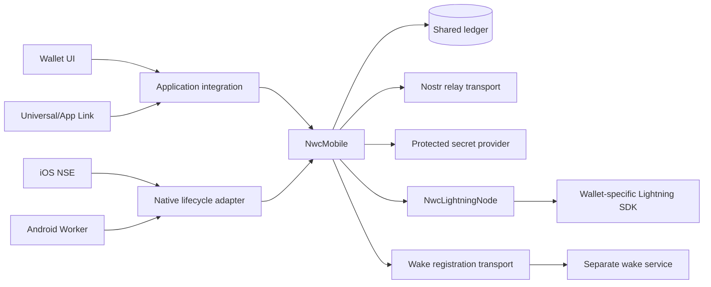

# Architecture and ownership boundaries

`nwc-mobile` follows a capabilities-and-adapters architecture. Rust owns NWC
protocol behavior and durable policy. The containing wallet supplies narrow
capabilities for its Lightning implementation and operating system.

## Responsibility matrix

| Concern | Owner |
| --- | --- |
| NIP-47 event validation, decryption, authorization, and response | `nwc-mobile` |
| Connection policy, budgets, revisions, tombstones, and replay protection | `nwc-mobile` |
| NWA parsing, request binding, approval, and callback construction | `nwc-mobile` |
| Background deadline, cancellation, retry classification, and durable claims | `nwc-mobile` plus the native lifecycle helper |
| Opening and synchronizing the Lightning wallet | Containing wallet |
| Converting wallet-specific records into NWC domain types | Containing wallet's `NwcLightningNode` |
| Secure-storage implementation and access-group configuration | Containing wallet/platform |
| Screens, navigation, localization, and platform link opening | Containing wallet |
| APNs/FCM credentials and notification delivery | Separate wake service |

## The six host integration pieces

### 1. UI

The application renders connection and NWA presentation models. UI code may
collect user choices, but Rust validates and applies those choices. Display
models must not become an independent authorization database.

### 2. Native background lifecycle

Swift owns NSE callbacks, App Group access, and Keychain calls. Kotlin owns FCM
callbacks, WorkManager scheduling, and Keystore calls. Neither platform should
parse Nostr events or decide whether a payment is allowed.

### 3. Lightning node adapter

`NwcLightningNode` is the wallet-specific boundary. It translates ordinary
balance, invoice, payment, lookup, and history operations between the wallet SDK
and `nwc-mobile` domain types.

### 4. NWA application glue

The host receives the inbound link, hands the complete string to Rust, renders
the returned request presentation, and opens the verified callback Rust
constructs. The term “handler” here means application routing, not a second NWA
implementation.

### 5. `NwcMobile` composition

`NwcMobileConfig` joins the shared data directory, `LightningNodeProvider`,
relay transport, and secret provider. `NwcMobile` owns the ledger, engine,
notification workers, cold node opening, and bounded execution.

### 6. Wake service

The wake service is untrusted delivery infrastructure. It sees public routing
identifiers and APNs/FCM destinations, observes Nostr relays, and wakes the
device. The wallet still authenticates and authorizes every event locally.

## Process model

Mobile applications have more than one execution context:

- the foreground application;
- an iOS NSE or Android worker; and
- later maintenance work after a timeout or process death.

Every context must use the same durable ledger and protected secrets. An open
foreground wallet object cannot be assumed to exist in a background process;
that is why `LightningNodeProvider` must be able to open the existing wallet
from application-owned configuration.

## High-level and low-level interfaces

Use `nwc_mobile_tokio::NwcMobile` by default. It assembles the ledger, engine,
node provider, notification workers, deadlines, cancellation, and completion
hook.

Use `NwcNode` only when the application already owns an open node and
deliberately wants to compose lower-level request and notification workers. New
mobile integrations should not begin at the engine traits or manually recreate
the `NwcMobile` orchestration.

## Repository boundaries

Generic NWC, NWA, wake, and security behavior belongs in this repository.
Wallet-SDK behavior belongs in the adopting wallet. Native packages contain
only reusable OS lifecycle mechanics. The deployed wake service remains a
separate project because it owns infrastructure credentials and server
operations, not wallet policy.
