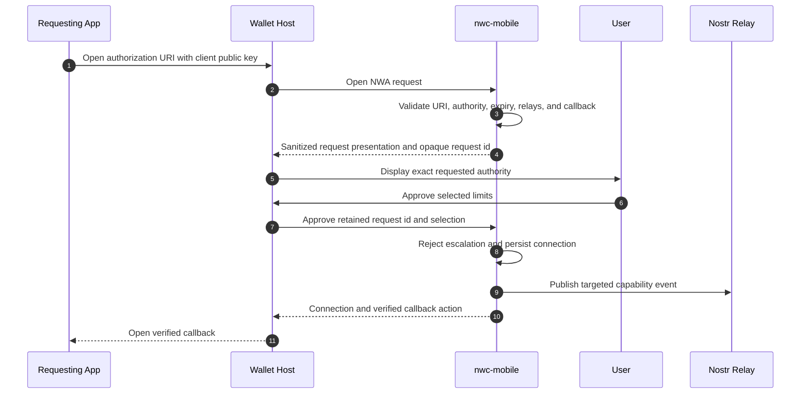
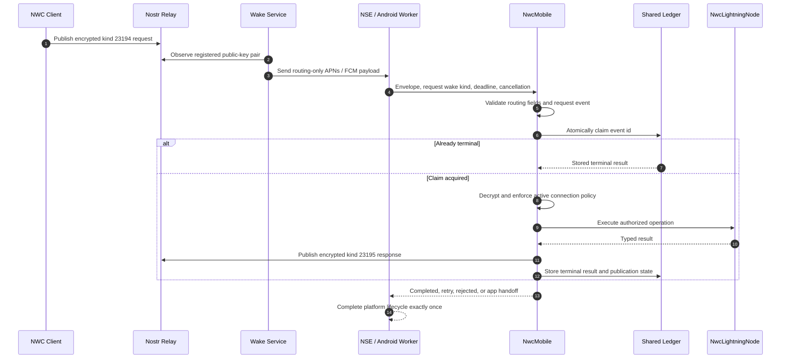
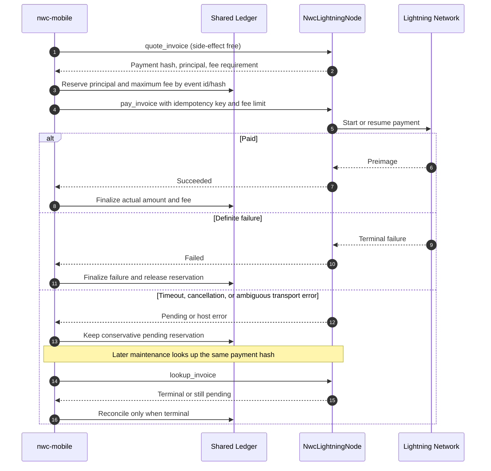
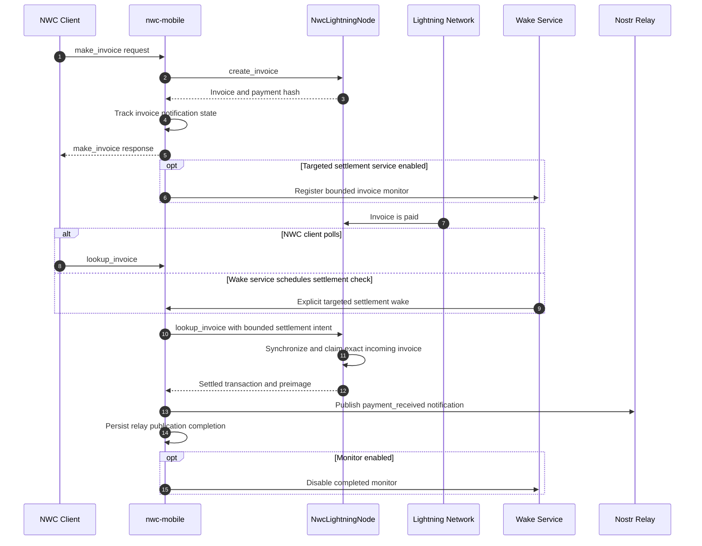

# Protocol and background flows

These diagrams show the ownership boundaries that must survive foreground,
background, timeout, and process-restart execution.

## NWA authorization

NWA establishes a connection. The requesting application keeps its client
secret; the wallet receives a public authorization request.

## Ordinary NWC wake

The wake service does not authorize the request. The device still validates the
event id, kind, signature, recipient, freshness, connection, method, and budget.

## Outgoing payment and recovery

The application must never interpret a timeout as proof that no payment
occurred. `pay_invoice` and wallet persistence must make retrying the same hash
idempotent.

## Incoming invoice settlement

Client polling remains compatible. A targeted settlement wake improves
reliability while the mobile wallet is suspended without sending a visible push
every few seconds. Settlement intent must be explicit and validated against the
locally tracked invoice.

## Foreground handoff

When a background process runs out of time, it returns a typed retry or
application-handoff disposition and stores recoverable state. Native code may
enqueue the normalized wake for the foreground application. The foreground path
must call the same Rust engine; it must not execute a second, less restrictive
implementation.
