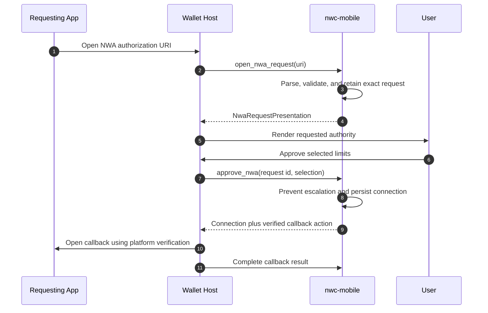

# Integrating Nostr Wallet Auth

Nostr Wallet Auth (NWA) creates and approves an NWC connection. NWC Wake later
delivers requests for that connection while the wallet is offline. They are
separate lifecycle stages.

## Protocol status

This project currently targets the client-created-secret NIP-47 flow proposed
in [nostr-protocol/nips#1818](https://github.com/nostr-protocol/nips/pull/1818).
The proposal is still under review, so applications must pin `nwc-mobile` to a
reviewed revision and test compatibility with the NWC clients they support.

## What the wallet implements

The application supplies:

- registration of its inbound authorization link;
- routing the complete inbound URI to its Rust application layer;
- an approval screen rendered from the returned presentation;
- explicit approve and cancel actions; and
- the platform call that opens a verified callback URL.

The application does not implement NWA parsing, authority comparison,
connection persistence, client-key handling, or callback construction.

## Application flow

## Required state binding

The approval screen must retain the opaque request identifier returned by
Rust. Approval must pass that same identifier back. Do not look up a pending
request by application name or client public key, and do not let a second URI
replace a request currently under review.

Render only the returned, sanitized presentation fields:

- requesting application metadata, labeled as unverified where appropriate;
- requested methods;
- budget and renewal interval;
- expiration;
- approved relays; and
- callback destination summary.

The user may reduce requested authority. Any expanded method, budget, relay, or
expiration must be treated as a new explicit selection and is still bounded by
library policy. Rust rejects authority that exceeds the retained request.

## Rust application API

`NwcApplicationManager` exposes the high-level workflow:

- `open_nwa_request`;
- `pending_nwa_request`;
- `approve_nwa`;
- `retry_nwa_callback`;
- `complete_nwa_callback`; and
- `cancel_nwa`.

The generated native facade exposes corresponding request presentation,
approval, and clearing operations. Keep one foreground manager in the
application's serialized Rust state so callback and pending-request transitions
cannot race.

## Callback rules

When an approved request contains a callback, Rust returns a validated callback
action. Native code should:

- use universal-link-only opening on iOS;
- require an app-only verified handler on Android;
- report whether the platform opened the link; and
- allow the shared callback coordinator to decide whether retry remains
  available.

Failure to open the callback does not revoke an already approved connection.
Never replace the verified HTTPS callback with a custom-scheme or browser
fallback.

## Secret ownership

In the client-created-secret flow, the requesting application retains the
client secret. The authorization request contains only its client public key.
The wallet stores the approved public identity and wallet-side connection
policy.

Complete NWC URIs and client secrets must not enter NWA callbacks, push
payloads, wake-service registration, logs, analytics, or UI state snapshots.

Next: [Building the NWA and NWC screens](nwc-ui.md).
